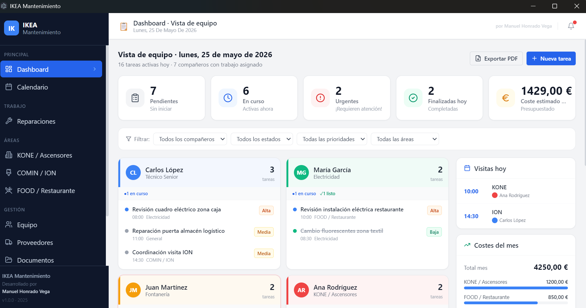
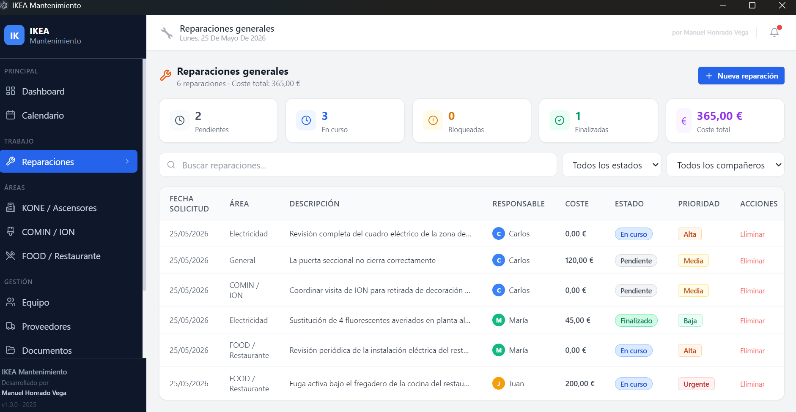

# IKEA Mantenimiento — Gestión de Equipo

**Aplicación de escritorio para la gestión interna del equipo de mantenimiento de IKEA.**

---

## Autoría y propiedad

| | |
|---|---|
| **Aplicación** | IKEA Mantenimiento |
| **Desarrollado por** | **Manuel Honrado Vega** |
| **Versión** | 1.0.0 |
| **Año** | 2025 |
| **Uso** | Interno · Equipo de Mantenimiento IKEA |

Esta aplicación ha sido diseñada y desarrollada íntegramente por **Manuel Honrado Vega** para uso exclusivo del equipo de mantenimiento de IKEA. Todos los derechos reservados.

---

## Capturas de pantalla

| Dashboard · Vista de equipo | Reparaciones generales |
|---|---|
|  |  |

---

## ¿Qué es esta aplicación?

Una herramienta de escritorio para Windows que permite al equipo de mantenimiento gestionar de forma centralizada:

- **Dashboard** común con la vista del día de todos los compañeros
- **Calendario** compartido del equipo
- **Tareas y reparaciones** por compañero y área
- **Incidencias KONE** (ascensores)
- **Trabajos COMIN/ION** (decoración)
- **Incidencias FOOD** (restaurante)
- **Reparaciones generales**
- **Gestión de proveedores**
- **Documentos y adjuntos**
- **Informes y estadísticas**
- **Exportación a PDF**

---

## Instalación para compañeros del equipo

*(Sin permisos de administrador, sin instalaciones raras)*

### Paso 1 — Descarga el archivo

Ve a la carpeta compartida de SharePoint del equipo y descarga el archivo:
`IKEA Mantenimiento-1.0.0-win.zip`

### Paso 2 — Descomprímelo

1. Clic derecho sobre el `.zip` descargado
2. **Extraer todo...**
3. Elige dónde guardarlo, por ejemplo: `C:\Users\TuNombre\AppEquipos`
4. Clic en **Extraer**

### Paso 3 — Abre la aplicación

Entra en la carpeta que acabas de descomprimir y haz doble clic en:
`IKEA Mantenimiento.exe`

### Paso 4 — Si Windows pone un aviso azul

Puede que aparezca una pantalla azul que diga *"Windows protegió su PC"*. Es normal porque la app no tiene firma digital de empresa.

1. Clic en **Más información**
2. Clic en **Ejecutar de todas formas**

### Paso 5 — Ya está

La aplicación se abre directamente. No necesitas instalación ni permisos especiales.

> **Consejo:** Clic derecho sobre `IKEA Mantenimiento.exe` → **Enviar a** → **Escritorio (crear acceso directo)** para tenerlo siempre a mano.

---

## Eliminar la aplicación

Como la app no se instala, para eliminarla simplemente **borra la carpeta** donde la descomprimiste. No deja ningún rastro en el sistema.

---

## Para el desarrollador — Generar nueva versión

### Paso 1 — Abre PowerShell en la carpeta del proyecto

```powershell
cd "C:\Users\myjho\OneDrive\Escritorio\AppEquipos"
```

### Paso 2 — Genera el ZIP

```powershell
npm run dist:win
```

Espera 2-3 minutos. Al terminar aparece:

```
✓ Listo: dist\IKEA Mantenimiento-1.0.0-win.zip (106 MB)
```

### Paso 3 — El archivo generado está aquí

```
AppEquipos\dist\IKEA Mantenimiento-1.0.0-win.zip
```

### Paso 4 — Súbelo a SharePoint

Abre la carpeta compartida del equipo en SharePoint y sube el ZIP.

### Paso 5 — Avisa al equipo

Mándales el enlace con las instrucciones de instalación de arriba.

> Cuando saques una nueva versión, repite desde el Paso 2. Los compañeros borran la carpeta antigua y descomprimen la nueva.

---

## Para el desarrollador — Arranque en modo desarrollo

```powershell
cd "C:\Users\myjho\OneDrive\Escritorio\AppEquipos"
npm run dev
```

La aplicación se abre automáticamente con recarga en caliente al guardar cambios.

---

## Tecnología

| Componente | Tecnología |
|---|---|
| Framework escritorio | Electron 31 |
| Interfaz | React 18 + TypeScript |
| Estilos | Tailwind CSS |
| Calendario | FullCalendar 6 |
| PDF | jsPDF + autotable |
| Empaquetado | Script propio (sin electron-builder) |

---

## Estructura del proyecto

```
AppEquipos/
├── src/
│   ├── main/
│   │   └── index.ts          ← Proceso principal de Electron
│   ├── preload/
│   │   └── index.ts          ← Bridge seguro IPC (contextBridge)
│   └── renderer/             ← Aplicación React
│       ├── App.tsx            ← Rutas y estructura
│       ├── main.tsx           ← Punto de entrada React
│       ├── index.html         ← HTML base
│       ├── index.css          ← Estilos globales + Tailwind
│       ├── components/
│       │   ├── Layout.tsx     ← Layout general
│       │   ├── Sidebar.tsx    ← Menú lateral
│       │   ├── Header.tsx     ← Cabecera
│       │   └── ui/            ← Componentes UI reutilizables
│       ├── pages/             ← Pantallas de la aplicación
│       │   ├── DashboardPage.tsx
│       │   ├── CalendarPage.tsx
│       │   ├── TeamPage.tsx
│       │   ├── KonePage.tsx
│       │   ├── CominIonPage.tsx
│       │   ├── FoodPage.tsx
│       │   ├── RepairsPage.tsx
│       │   ├── ProvidersPage.tsx
│       │   ├── DocumentsPage.tsx
│       │   ├── ReportsPage.tsx
│       │   └── SettingsPage.tsx
│       ├── lib/
│       │   ├── mockData.ts    ← Datos de ejemplo (Fase 1)
│       │   └── utils.ts       ← Utilidades
│       └── types/
│           └── index.ts       ← Tipos TypeScript
├── scripts/
│   ├── dev.js                 ← Lanzador dev (limpia ELECTRON_RUN_AS_NODE)
│   └── dist-win.js            ← Empaquetador sin firma de código
├── database/
│   ├── schema.sql             ← Esquema SQLite completo
│   └── seed.sql               ← Datos iniciales de ejemplo
└── resources/
    └── icon.ico               ← Icono de la aplicación (opcional)
```

---

## Hoja de ruta

### ✅ Fase 1 (actual) — Estructura y UI
- Electron + React + TypeScript + Tailwind
- Layout con menú lateral
- Dashboard con vista de equipo
- Todas las pantallas estructuradas con datos de ejemplo
- Schema SQL completo preparado para Fase 2

### 🔄 Fase 2 — Base de datos SQLite real
- Integrar better-sqlite3 en el proceso main
- Servicios IPC para CRUD completo
- Migración de mock data a SQLite
- Ruta configurable desde Ajustes (OneDrive/SharePoint)

### 🔄 Fase 3 — Dashboard y Calendario completos
- CRUD completo de tareas
- Formularios con validación
- Filtros funcionales
- Calendario interactivo

### 🔄 Fase 4 — Módulos específicos
- KONE, COMIN/ION, FOOD, Reparaciones: CRUD completo
- Documentos con apertura de archivos
- Cálculos automáticos de costes

### 🔄 Fase 5 — Informes y exportación
- Exportación PDF real (jsPDF)
- Backup de base de datos

---

## Notas sobre OneDrive/SharePoint

Cuando en Fase 2 se active la base de datos real:

- ⚠️ SQLite + sincronización simultánea puede causar problemas si varias personas escriben a la vez.
- ✅ **Recomendación**: usar la app de uno en uno, o pausar la sincronización de OneDrive mientras está en uso activo.
- 🔄 **Futuro**: migración a API central con PostgreSQL si el equipo crece.

---

*Desarrollado por Manuel Honrado Vega — IKEA Mantenimiento v1.0.0*
